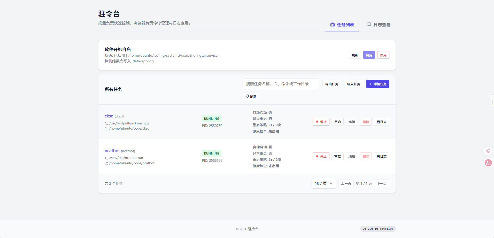
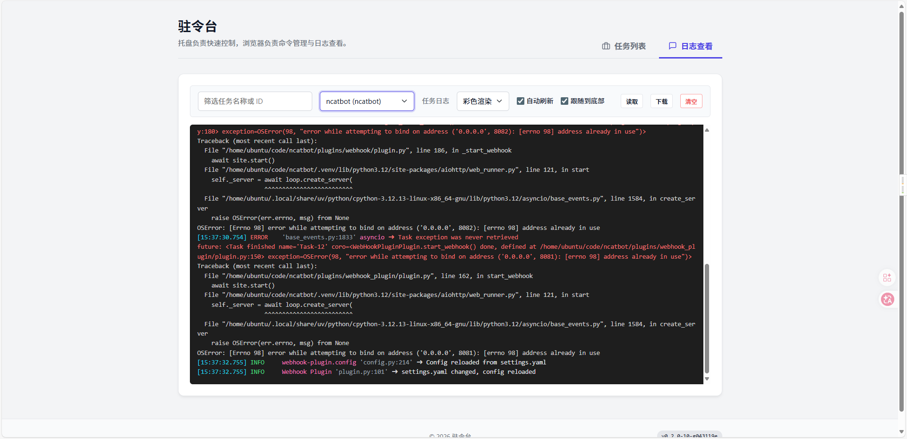
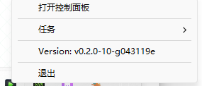
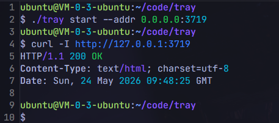

# 驻令台

> 把“托盘快速启停”和“浏览器精细管理”合在一起的本地命令管理器。


驻令台适合管理这些常驻命令：

- `openlist.exe server`
- `gitea web`
- `.venv/bin/ncatbot run`
- `python3 main.py`
- 其他本地脚本、守护进程、辅助服务

它把职责拆成两层：

- 托盘负责：快速启动、停止、退出、查看版本
- 浏览器负责：任务管理、日志查看、状态观察、参数配置

## 命名说明

- 项目名：`驻令台`
- 仓库名：`zhulingtai`
- 可执行文件：`zlt`

这三个名字分别服务于不同场景：

- `驻令台` 用于产品展示、文档标题、界面文案
- `zhulingtai` 用于仓库、Go module、源码路径
- `zlt` 用于命令行、构建产物和发布包文件名

## 为什么叫“驻令台”

这个名字来自三个意思：

- `驻`：强调常驻运行、后台守护、托盘常驻
- `令`：强调命令、脚本、服务进程
- `台`：强调统一管理入口，像一个控制台

它不是单纯的“命令启动器”，而是一个面向本地服务管理的驻留控制台，所以叫“驻令台”。

## 功能特性

- 托盘菜单快速启动和停止任务
- 浏览器管理任务的增删改查
- 任务配置持久化到 SQLite
- 支持任务自动启动
- 支持异常退出后自动重启
- 支持健康检查与失败阈值配置
- 支持 Cron 计划任务：定时启动、停止、重启已登记任务
- 支持任务日志查看、下载、清空
- 支持系统日志 `data/app.log` 查看
- 支持 ANSI 彩色日志渲染
- 支持任务列表搜索、筛选和分页
- 支持 Linux 无界面运行
- 支持构建时注入版本、提交、平台、时间等信息
- Windows 构建自动注入图标

## 项目结构

```text
.
├── cmd/
│   └── zlt/             # CLI / GUI 入口
├── internal/            # 核心实现
│   ├── api/             # HTTP API
│   ├── app/             # 运行时、托盘、CLI、自启动
│   ├── process/         # 进程管理
│   ├── scheduler/       # Cron 计划任务调度器
│   ├── store/           # SQLite 持久化
│   └── task/            # 任务与计划模型
├── scripts/             # 构建与发布脚本
├── web/                 # 内嵌网页面板
├── ico.ico              # Windows 图标，固定放仓库根目录
├── Taskfile.yml         # 常用任务
└── embed_assets.go      # 静态资源嵌入
```

## 使用方式

### 1. 构建

当前项目使用 `Taskfile` 管理构建任务：

```sh
task build:current
task build:windows
task build:linux
task build:darwin
```

构建产物输出到：

```text
bin/
```

### 2. 运行

当前平台直接运行：

```sh
./bin/zlt-current
```

查看版本：

```sh
./bin/zlt-current version
```

Windows GUI 版：

```sh
./bin/zlt-windows-amd64.exe
```

默认控制面板地址：

```text
http://127.0.0.1:3719
```

### 3. Linux 无界面模式

```sh
./bin/zlt-linux-amd64 run
./bin/zlt-linux-amd64 start
./bin/zlt-linux-amd64 status
./bin/zlt-linux-amd64 stop
./bin/zlt-linux-amd64 restart
```

指定监听地址：

```sh
./bin/zlt-linux-amd64 run --addr 0.0.0.0:3719
./bin/zlt-linux-amd64 start --addr 0.0.0.0:3719
```

帮助信息：

```sh
./bin/zlt-linux-amd64 -h
./bin/zlt-linux-amd64 start -h
./bin/zlt-linux-amd64 version
```

### 4. 软件开机自启

Linux：

```sh
./bin/zlt-linux-amd64 autostart enable
./bin/zlt-linux-amd64 autostart status
./bin/zlt-linux-amd64 autostart disable
```

当前 Linux 实现基于 `systemd --user`。

Windows 可在网页里直接查看、启用、停用软件开机自启。

## 任务配置示例

### OpenList

```json
{
  "id": "openlist",
  "name": "OpenList",
  "program": "openlist.exe",
  "args": ["server"],
  "workdir": "D:/SoftWare/OpenList",
  "env": [],
  "autostart": false,
  "restart_on_crash": false,
  "stop_timeout_sec": 8,
  "restart_delay_sec": 2,
  "max_restart_count": 0,
  "health_check_url": "",
  "health_check_interval_sec": 0,
  "health_check_failure_threshold": 0
}
```

### Python 脚本

```json
{
  "id": "cksd",
  "name": "cksd",
  "program": "/usr/bin/python3",
  "args": ["main.py"],
  "workdir": "/home/ubuntu/code/cksd",
  "env": [],
  "autostart": false,
  "restart_on_crash": false,
  "stop_timeout_sec": 8,
  "restart_delay_sec": 2,
  "max_restart_count": 0,
  "health_check_url": "",
  "health_check_interval_sec": 0,
  "health_check_failure_threshold": 0
}
```

### Python 虚拟环境命令

```json
{
  "id": "ncatbot",
  "name": "ncatbot",
  "program": "/home/ubuntu/code/ncatbot/.venv/bin/ncatbot",
  "args": ["run"],
  "workdir": "/home/ubuntu/code/ncatbot",
  "env": [],
  "autostart": false,
  "restart_on_crash": false,
  "stop_timeout_sec": 8,
  "restart_delay_sec": 2,
  "max_restart_count": 0,
  "health_check_url": "",
  "health_check_interval_sec": 0,
  "health_check_failure_threshold": 0
}
```

说明：

- 不需要先执行 `activate`
- 推荐直接填写虚拟环境中的可执行文件
- 相同的 `python3 main.py` 会结合工作目录做识别，避免不同项目混淆

## 计划任务

网页面板的“计划任务”页可以为已登记任务配置 Cron 定时动作：

- 动作：`start`（启动）、`stop`（停止）、`restart`（重启）
- 表达式：标准 5 段 Cron（`分 时 日 月 周`），例如 `0 8 * * 1-5` 表示工作日 08:00
- 时区：默认跟随系统，可显式指定 IANA 时区（如 `Asia/Shanghai`）
- 支持启用/停用、立即执行（便于测试配置）、下次执行时间与最近执行结果展示

执行语义：

- 任务已在运行时执行 `start`：跳过并记录 `already_running`
- 任务已停止时执行 `stop`：跳过并记录 `already_stopped`
- 同一计划上一次尚未结束时，下一次触发直接跳过
- 计划保存时校验表达式与时区，非法配置直接拒绝
- 任务被导入覆盖后，引用了不存在任务的计划会自动停用并记录原因
- 任务存在关联计划时不允许直接删除，需先删除计划

注意：计划由驻令台进程内的调度器执行，应用未运行时不会触发。建议生产环境配合“软件开机自启”或 `zlt start` 后台模式使用。

对应 API：

```text
GET    /api/schedules
POST   /api/schedules
PUT    /api/schedules/{id}
DELETE /api/schedules/{id}
POST   /api/schedules/{id}/enable
POST   /api/schedules/{id}/disable
POST   /api/schedules/{id}/run
```

## 效果图

当前界面分为两部分：

- 托盘菜单：适合快速启停任务
- 浏览器面板：适合任务管理和日志查看

建议在开源发布时补充以下截图到仓库中，例如 `docs/images/`：

- 任务列表页

  

- 日志查看页

  

- Windows 托盘菜单

  

- Linux 无界面运行示例
  

## 日志说明

任务日志行为：

- 每个任务统一写入 `data/logs/<task_id>/app.log`
- 旧版本遗留的 `stdout.log` 和 `stderr.log` 仍可兼容读取
- 网页支持 ANSI 彩色渲染和纯文本切换

系统日志行为：

- 程序自身日志写入 `data/app.log`
- 网页日志页可直接查看系统日志

## 发布

```sh
task version
task release:windows
task release:linux
task release:darwin
```

GitHub Actions 已内置两套工作流：

- `CI`：在 `push main` 和 `pull request` 时自动执行 `go test ./...` 与跨平台构建检查
- `Release`：在推送 `v*` 标签时自动打包 Windows、Linux、macOS 产物，并发布到 GitHub Release

发布 GitHub 版本的推荐流程：

```sh
git tag v0.2.1
git push origin main --tags
```

发布目录：

```text
dist/<version>/
```

说明：

- Windows 产物输出为 `.exe`
- Linux 和 macOS 产物输出为 `.tar.gz`
- Linux 和 macOS 压缩包在打包前会自动写入可执行权限
- GitHub Release 会额外上传 `SHA256SUMS.txt` 供校验使用

## 开发

### 环境要求

- Go 1.25+
- `task`（推荐）

### 常用命令

```sh
task version
task build:current
task build:windows
task build:linux
task build:darwin
go test ./...
```

### 开发约定

- `ico.ico` 固定放在仓库根目录
- `web/` 保持在仓库根目录
- `data/` 是本地运行数据目录，不参与提交
- `bin/`、`dist/`、`.gocache/`、`.gomodcache/`、`.gotmp/`、`.tools/` 都是构建产物或缓存

### 当前实现重点

- 任务配置使用 SQLite 持久化
- 托盘和网页共享同一套运行时状态
- 启动时先起 HTTP 与 Cron 调度器，再处理自动启动任务
- 退出时先停调度器，再停任务，最后关闭 HTTP 和托盘
- Windows、Linux、macOS 都有对应构建流程
- Go module 名称为 `zhulingtai`
- 最终用户使用的命令名称为 `zlt`

## 社区支持

<div align="center">
**学 AI，上 L 站**

[](https://linux.do/) [](https://linux.do/)

本项目在 [LINUX DO](https://linux.do/) 社区发布与交流，感谢佬友们的支持与反馈。

</div>

## 许可证

GPL-3.0 License. See [LICENSE](./LICENSE).
