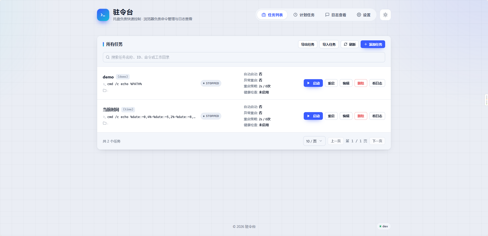
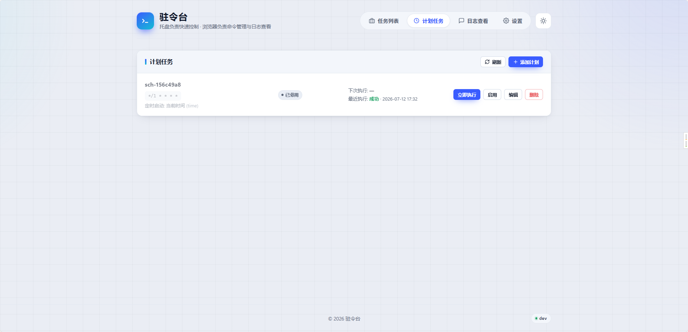
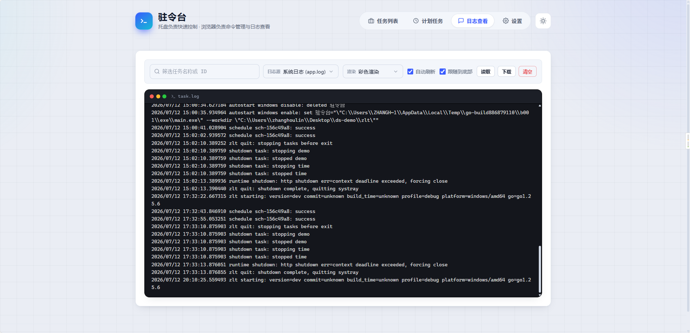
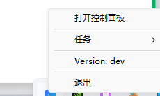
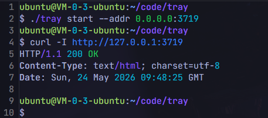

# 驻令台

> 把“托盘快速启停”和“浏览器精细管理”合在一起的本地命令管理器。


驻令台用于统一管理本地脚本、守护进程和辅助服务。托盘负责快速启停，浏览器面板负责任务配置、状态观察、计划调度和日志查看。

## 功能特性

- 托盘菜单快速启动、停止任务
- 浏览器管理任务的增删改查
- SQLite 持久化任务和计划配置
- 任务自动启动、异常重启和健康检查
- Cron 计划任务定时启动、停止或重启任务
- 任务日志与系统日志查看、下载和清理
- ANSI 彩色日志渲染
- 任务搜索、筛选和分页（含"全部"模式）
- 任务和计划列表拖拽排序，顺序持久化
- 密钥鉴权保护管理界面，闲置 7 天自动过期，前台操作续期
- Windows 软件开机自启与 Linux 无界面运行
- Windows、Linux、macOS 跨平台构建与发布

## 快速开始

```sh
task build:current
./bin/zlt-current
```

Windows GUI 版：

```sh
./bin/zlt-windows-amd64.exe
```

默认控制面板地址：`http://127.0.0.1:3719`

> 每个版本的更新内容统一记录在 [CHANGELOG.md](./CHANGELOG.md)。

## 访问鉴权

驻令台的管理界面受密钥鉴权保护。首次启动时自动生成一个随机密钥,保存在 `data/auth.key`。浏览器首次访问需要输入此密钥登录。

密钥就是 `data/auth.key` 中保存的一段文本:首次启动自动生成一个随机字符串;也可以手动指定一个容易记忆的口令(见下)。

### 查看密钥

```sh
# 命令行
./bin/zlt-current auth show

# Windows 托盘菜单 → "查看访问密钥"(用记事本打开密钥文件)
```

### 手动设置密钥

想自己指定一个容易记忆的密钥(例如在手机上访问时不想复制一长串随机字符),先停止服务后执行:

```sh
./bin/zlt-current auth set 'my-memorable-passphrase'
```

要求实例已停止;设置后 `data/auth.db` 被删除,所有已登录浏览器需要重新登录。下次启动后,登录时直接输入该口令即可。

### 浏览器登录

1. 打开控制面板,看到登录卡片
2. 输入访问密钥(自动生成的随机字符串,或手动设置的口令),勾选"记住此浏览器"(默认勾选)
3. 登录成功后加载任务、计划、日志和实时连接

### 会话与闲置续期

- 登录后服务端签发会话令牌,通过 HttpOnly + SameSite=Strict Cookie 保存
- 服务端闲置 7 天过期;实际前台操作(点击、键盘、触摸、滚动)最多每 60 秒续期一次
- 普通轮询、SSE 保活和隐藏页面活动不续期
- 勾选"记住"后浏览器和服务端重启后保持登录;未勾选则关闭浏览器即失效

### 退出登录

点击右上角退出按钮,或密钥重置/变更后所有浏览器自动失效。

### 重置密钥

```sh
./bin/zlt-current auth reset           # 默认实例
./bin/zlt-current auth reset --pid-file data/zlt.pid
```

重置要求对应实例已停止。删除 `data/auth.key` 和 `data/auth.db`,下次启动自动生成新的随机密钥,所有已登录浏览器需要重新登录。

### 反向代理与 HTTPS

通过 `ZLT_PUBLIC_URL` 环境变量声明公开地址后，Cookie 启用 Secure，托盘和重复启动打开的控制面板使用该地址：

```sh
export ZLT_PUBLIC_URL=https://zlt.example.com
./bin/zlt-current run
```

反向代理配置要点：

- 转发到本机 HTTP 监听端口（默认 `127.0.0.1:3719`）
- 保留公开 Host 头
- 关闭 SSE 缓冲（Nginx 加 `proxy_buffering off` 或 `X-Accel-Buffering: no`）
- 可信代理范围默认仅回环地址；如需信任非回环代理，用 `ZLT_TRUSTED_PROXIES` 指定 CIDR

```nginx
location / {
    proxy_pass http://127.0.0.1:3719;
    proxy_set_header Host $host;
    proxy_buffering off;
    proxy_cache off;
    # SSE 长连接
    proxy_read_timeout 1h;
}
```

### 脚本访问管理接口

升级后，所有管理接口需要登录会话。脚本需要先登录获取 Cookie 和 CSRF token：

```sh
# 登录并保存 Cookie
KEY=$(./bin/zlt-current auth show)
curl -c cookies.txt -X POST http://127.0.0.1:3719/api/auth/login \
  -H "Content-Type: application/json" \
  -H "Origin: http://127.0.0.1:3719" \
  -d "{\"key\":\"$KEY\",\"remember\":false}"

# 从登录响应或 /api/auth/session 获取 csrf_token，写入请求头
CSRF=$(curl -b cookies.txt http://127.0.0.1:3719/api/auth/session | jq -r .data.csrf_token)

# 带 Cookie 和 CSRF 发送写请求
curl -b cookies.txt -H "X-CSRF-Token: $CSRF" \
  -X POST http://127.0.0.1:3719/api/tasks \
  -H "Content-Type: application/json" -d '{...}'
```

### 升级说明

- 数据库迁移自动执行：tasks 和 schedules 表增加 `sort_order` 列，按旧顺序回填
- 首次升级后启动自动生成密钥文件 `data/auth.key`，之后访问管理接口需要登录
- 原有任务和计划数据完全兼容，顺序保持不变
- 旧版本升级后,已登录浏览器会失效一次,需用 `zlt auth show` 重新登录;之后会话仍按 7 天闲置过期续期

<details>
<summary>项目命名与设计理念</summary>

- 项目名：`驻令台`
- 仓库名：`zhulingtai`
- 可执行文件：`zlt`

“驻”表示常驻运行与后台守护，“令”表示命令、脚本和服务进程，“台”表示统一管理入口。驻令台不是单纯的命令启动器，而是面向本地服务管理的驻留控制台。

</details>

<details>
<summary>项目结构</summary>

```text
.
├── cmd/zlt/             # CLI / GUI 入口
├── internal/
│   ├── api/             # HTTP API
│   ├── app/             # 运行时、托盘、CLI、自启动
│   ├── auth/            # 密钥鉴权、会话、CSRF
│   ├── process/         # 进程管理
│   ├── scheduler/       # Cron 计划任务调度器
│   ├── store/           # SQLite 持久化
│   └── task/            # 任务与计划模型
├── scripts/             # 构建与发布脚本
├── web/                 # 内嵌网页面板
├── ico.ico              # Windows 图标
├── Taskfile.yml         # 常用任务
└── embed_assets.go      # 静态资源嵌入
```

</details>

<details>
<summary>构建与运行命令</summary>

构建：

```sh
task build:current
task build:windows
task build:linux
task build:darwin
```

查看版本：

```sh
./bin/zlt-current version
```

Linux 无界面模式：

```sh
./bin/zlt-linux-amd64 run
./bin/zlt-linux-amd64 start
./bin/zlt-linux-amd64 status
./bin/zlt-linux-amd64 stop
./bin/zlt-linux-amd64 restart
```

指定监听地址：

```sh
./bin/zlt-linux-amd64 run --addr 0.0.0.0:3719
./bin/zlt-linux-amd64 start --addr 0.0.0.0:3719
```

Linux 软件开机自启：

```sh
./bin/zlt-linux-amd64 autostart enable
./bin/zlt-linux-amd64 autostart status
./bin/zlt-linux-amd64 autostart disable
```

访问密钥管理：

```sh
./bin/zlt-current auth show              # 查看密钥
./bin/zlt-current auth reset             # 重置密钥（需先停止）
```

Windows 可在网页"设置"页面查看、启用或停用软件开机自启。

</details>

<details>
<summary>任务配置示例</summary>

```json
{
  "id": "openlist",
  "name": "OpenList",
  "program": "openlist.exe",
  "args": ["server"],
  "workdir": "D:/SoftWare/OpenList",
  "env": [],
  "autostart": false,
  "restart_on_crash": false,
  "stop_timeout_sec": 8,
  "restart_delay_sec": 2,
  "max_restart_count": 0,
  "health_check_url": "",
  "health_check_interval_sec": 0,
  "health_check_failure_threshold": 0
}
```

Python 虚拟环境建议直接填写解释器路径，不需要提前执行 `activate`：

```json
{
  "id": "python-service",
  "name": "Python Service",
  "program": "/home/user/project/.venv/bin/python",
  "args": ["main.py"],
  "workdir": "/home/user/project",
  "env": []
}
```

</details>

<details>
<summary>Cron 计划任务</summary>

网页“计划任务”页面可为已登记任务配置定时动作：

- 动作：`start`、`stop`、`restart`
- 表达式：标准 5 段 Cron，例如 `0 8 * * 1-5`
- 时区：默认跟随系统，也可指定 `Asia/Shanghai` 等 IANA 时区
- 支持启用、停用、立即执行、下次执行时间和最近执行结果

执行规则：

- 已运行任务再次执行 `start` 时跳过
- 已停止任务再次执行 `stop` 时跳过
- 同一计划上一次未结束时跳过重复触发
- 非法 Cron 表达式或时区无法保存
- 存在关联计划的任务不能直接删除
- 驻令台未运行时，进程内计划不会触发

API：

```text
GET    /api/schedules
POST   /api/schedules
PUT    /api/schedules/{id}
DELETE /api/schedules/{id}
POST   /api/schedules/{id}/enable
POST   /api/schedules/{id}/disable
POST   /api/schedules/{id}/run
```

任务和计划排序：

```text
PUT    /api/tasks-order        # {ids: [...], base_ids: [...]}
PUT    /api/schedules-order     # {ids: [...], base_ids: [...]}
```

</details>

<details>
<summary>日志说明</summary>

- 任务日志写入 `data/logs/<task_id>/app.log`
- 旧版 `stdout.log` 和 `stderr.log` 仍可兼容读取
- 系统日志写入 `data/app.log`
- 网页支持 ANSI 彩色渲染、纯文本切换、下载和清理

</details>

<details>
<summary>界面截图</summary>
任务列表：



计划任务：



日志查看：



Windows 托盘菜单：



Linux 无界面运行：



</details>

<details>
<summary>发布与开发</summary>

环境要求：Go 1.25+，推荐安装 `task`。

```sh
task version
task release:windows
task release:linux
task release:darwin
go test ./...
```

推送 `v*` 标签后，GitHub Actions 会自动构建 Windows、Linux、macOS 产物，生成 Release Notes，并更新 [CHANGELOG.md](./CHANGELOG.md)。

```sh
git tag v0.2.6
git push origin main --tags
```

发布产物位于 `dist/<version>/`。Windows 使用 `.exe`，Linux 和 macOS 使用 `.tar.gz`，并提供 `SHA256SUMS.txt`。

开发约定：

- `ico.ico`、`web/` 固定保留在仓库根目录
- `data/` 为本地运行数据，不参与提交
- `bin/`、`dist/`、`.gocache/`、`.gomodcache/`、`.gotmp/`、`.tools/` 为构建产物或缓存

</details>

## 社区支持

<div align="center">

**学 AI，上 L 站**

[](https://linux.do/) [](https://linux.do/)

本项目在 [LINUX DO](https://linux.do/) 社区发布与交流，感谢佬友们的支持与反馈。

</div>

## 许可证

GPL-3.0 License. See [LICENSE](./LICENSE).
